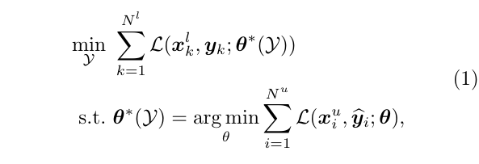
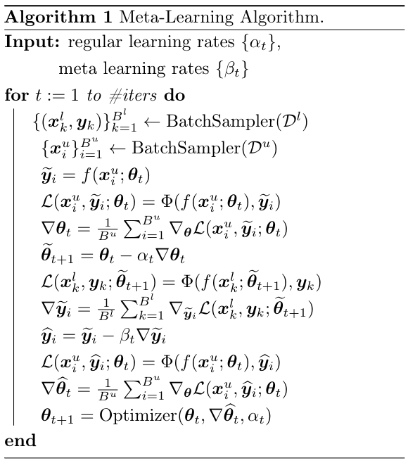

# Semi-Supervised Learning with Meta-Gradient

Official implementation of paper: **Semi-Supervised Learning with Meta-Gradient** (AISTATS 2021), by Xin-Yu Zhang, Taihong Xiao, Haolin Jia, Ming-Ming Cheng, and Ming-Hsuan Yang. [[paper](https://arxiv.org/abs/2007.03966), [poster](images/aistats-poster.pdf), [video](images/poster-video.mp4), [short slides](images/brief-slides.pdf), [full slides](images/full-slides.pdf)]

Under construction.

## Introduction

This repository contains the official implementation of the `MetaSemi` algorithm for Semi-Supervised Learning (SSL). `MetaSemi` is a consistency-based SSL algorithm in which the **consistency loss** is guided by the **label information** of the specific task of interst. However, the consistency loss seems to have no relationship with the label information, so we borrow the idea of meta-learning to establish their relationship by differentiating through the gradient descent step.

## Algorithm

we formulate SSL as a bi-level optimization problem, as shown in the following image:


Solving the exact optimization problem is computationally prohibitive, so we adopt an online approximation approach. The `MetaSemi` algorithm is summarized below:


Apart from meta-learning, we adopt several tricks to alleviate computation overhead and promote performance. Please refer to our [paper](https://arxiv.org/abs/2007.03966) for these details.

## Reproduce the Experimental Results

### Prerequisite

Please make sure the following packages are installed in your environment:

| **Package**    | **Version**  |
|----------------|--------------|
| python         |  >=3.5       |
| pytorch        |  >=1.2       |
| tensorboardX   |  >=2.0       |

Also, we provide the [Dockerfile](Docker/Dockerfile) containing all necessary dependencies. You can simply run the following commands to enter the docker environment:

```
cd Docker
sudo docker build .
sudo docker images
sudo docker run <the-image-id> --network=host        # Enter the image id shown in the last command
sudo docker ps
sudo docker exec -it <the-container-id> bash         # Enter the container id shown in the last command
```

### SVHN and CIFAR Datasets

Our performance on SVHN and CIFAR datasets is as follows:

|    **Dataset**    |   **SVHN**   | **CIFAR-10** | **CIFAR-100** |
|-------------------|--------------|--------------|---------------|
| **Num of Labels** |     1000     |     4000     |     10000     |
|   **Error Rate**  |     3.15%    |     7.78%    |     30.74%    |

To reproduce these results, run the following commands:

```
# SVHN
CUDA_VISIBLE_DEVICES='0' python3 train_meta.py --dataset "svhn" --num-label "1000" -a "convlarge" --mix-up --alpha "0.1" --save-path "results/svhn" --seed "7788" --weight-decay "5e-5" --gpu;

# CIFAR-10
CUDA_VISIBLE_DEVICES='0' python3 train_meta.py --dataset "cifar10" --num-label "4000" -a "convlarge" --mix-up --alpha "1.0" --save-path "results/cifar-10" --seed "8469" --weight-decay "1e-4" --gpu;

# CIFAR-100
CUDA_VISIBLE_DEVICES='0' python3 train_meta.py --dataset "cifar100" --num-label "10000" -a "convlarge" --mix-up --alpha "1.0" --save-path "results/cifar-100" --seed "7788" --weight-decay "1e-4" --gpu;

```

Please omit the `--gpu` flag and `CUDA_VISIBLE_DEVICES='0'` prefix if there is no GPU device available.

### ImageNet Dataset

Our performance on ImageNet dataset is as follows:

|    **ImageNet**    | **Num of Labels** | **Top-1 Error** | **Top-5 Error** |
|--------------------|-------------------|-----------------|-----------------|
|                    |    ~128k (10%)    |      44.87%     |      18.88%     |

#### Prepare the ImageNet Recoder

Our ImageNet experiment is based on the [NVIDIA-DALI](https://docs.nvidia.com/deeplearning/dali/user-guide/docs/) pipeline. Before running the codes, we need to prepare the ImageNet recorder.

You have to download the original ImageNet dataset on your server. Please refer to its official [instructions](http://image-net.org/download). The downloaded files should be originzed in the following structure:
```
/your-download-path
├── train
│   ├── n01440764
│   │   ├── n01440764_10470.JPEG
│   │   ├── n01440764_11151.JPEG
│   │   ├── n01440764_12021.JPEG
│   │   ├── ...
│   ├── n01443537
│   │   ├── n01443537_11513.JPEG
│   │   ├── n01443537_12098.JPEG
│   │   ├── n01443537_12507.JPEG
│   │   ├── ...
│   ├── n01484850
│   │   ├── n01484850_10370.JPEG
│   │   ├── n01484850_1054.JPEG
│   │   ├── n01484850_13243.JPEG
│   │   ├── ...
│   ├── ...
├── val
│   ├── n01440764
│   │   ├── ILSVRC2012_val_00000293.JPEG
│   │   ├── ILSVRC2012_val_00002138.JPEG
│   │   ├── ILSVRC2012_val_00003014.JPEG
│   │   ├── ...
│   ├── ...
```

Then, run the following commands to splits the ImageNet into labeled/unlabeled data:
```
cd imagenet;
python3 split_imagenet.py --data-path "/your-download-path";
```

After this, there will be four sub-directories under `/your-download-path`:
```
/your-download-path
├── train
├── val
├── labeled
├── unlabeled
```

P.S. Please make sure that your disk have enough space available, since this operation will copy the whole ImageNet (>=150G will be enough). Besides, absolution path is preferred in the above arguments. Running these commands may take a while.

Now, it's time to build the image recorder (See [reference](https://cv.gluon.ai/build/examples_datasets/recordio.html#sphx-glr-download-build-examples-datasets-recordio-py)). Run the following commands:
```
# For labeled data
python3 im2rec.py ./train_label /path/to/save/split/data/labeled/ --recursive --list --num-thread 8
python3 im2rec.py ./train_label /path/to/save/split/data/labeled/ --recursive --pass-through --pack-label --num-thread 8

# For unlabeled data
python3 im2rec.py ./train_unlabel /path/to/save/split/data/unlabeled/ --recursive --list --num-thread 8
python3 im2rec.py ./train_unlabel /path/to/save/split/data/unlabeled/ --recursive --pass-through --pack-label --num-thread 8

# For validation data
python im2rec.py ./val /your-download-path/val --recursive --list --num-thread 8
python im2rec.py ./val /your-download-path/val --recursive --pass-through --pack-label --no-shuffle --num-thread 8
```

Again, the resulting `*.rec` files are still copies of ImageNet, so please make sure enough space is available. Finally, under `/your-download-path`, there should be nine files:
```
/your-download-path
├── train_label.idx
├── train_label.lst
├── train_label.rec
├── train_unlabel.idx
├── train_unlabel.lst
├── train_unlabel.rec
├── val.idx
├── val.lst
├── val.rec
```

You only need these nine files to run experiments on ImageNet. Other files are at your disposal.

#### Run Experiments on ImageNet

The following command runs the SSL experiment on ImageNet. We assume eigen GPUs are used in training. The argument `--data` specifies the directory that contains the above-mentioned nine files.
```
CUDA_VISIBLE_DEVICES='0,1,2,3,4,5,6,7' python -m torch.distributed.launch --nproc_per_node=8 train_meta_imagenet.py -a "resnet18" --data "/path/to/rec" --save-path "results/imagenet-meta" --batch-size "64" --alpha "1.0";
```

We also provide script to run the baseline model (labeled-data-only):
```
CUDA_VISIBLE_DEVICES='0,1,2,3' python3 -m torch.distributed.launch --nproc_per_node=4 train_imagenet.py -a "resnet18" --data "/path/to/rec" --save-path "results/imagenet-baseline" --batch-size "128";
```

### Visualize Features in 2D Space

To reproduce Fig. 3 in our [paper](https://arxiv.org/abs/2007.03966), run the following commands:

```
# SVHN
CUDA_VISIBLE_DEVICES="0" python3 plot_features.py --dataset "svhn" --checkpoint-path "results/svhn/model_best.pth" --index-path "results/svhn/label_indices.txt" --save-path "results/svhn/visualization" --num-point '5000';

CUDA_VISIBLE_DEVICES="0" python3 plot_features.py --dataset "cifar10" --checkpoint-path "results/cifar-10/model_best.pth" --index-path "results/cifar-10/label_indices.txt" --save-path "results/cifar-10/visualization" --num-point '5000';
```

## Citation

If you find our work intersting or helpful to your research, please consider citing our paper.

```
@inproceedings{zhang2020semisupervised,
  author    = {Xin-Yu Zhang and Taihong Xiao and Haolin Jia and Ming-Ming Cheng and Ming-Hsuan Yang},
  title     = {{Semi-Supervised Learning with Meta-Gradient}},
  booktitle = International Conference on Artificial Intelligence and Statistics (AISTATS),
  year      = {2021}
}
```
